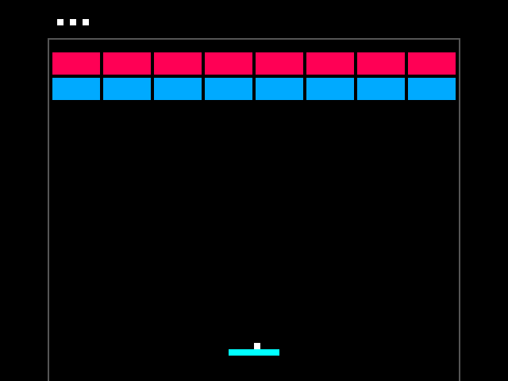
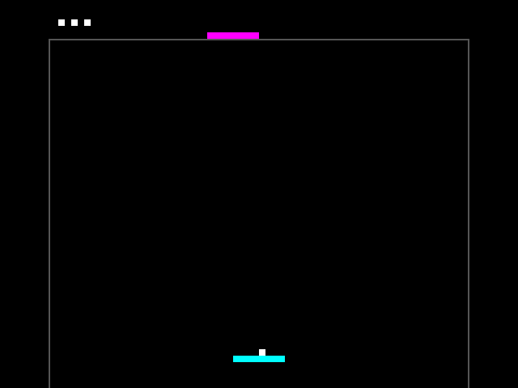
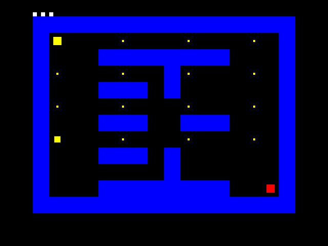

# Tiny Arcade: Breakout, Pong & Pacman

Three games in Verilog for the **Tiny Tapeout ETR/FabricFox FPGA kit**, targeting
**SKY 26d / SKY130, one tile**. Shared video and game logic generate 640×480 VGA
at 60 Hz with RGB222 (64 colors), without a framebuffer. The onboard 7-segment
display shows lives as horizontal bars: bottom for one, bottom + middle for two,
and all three for three; zero is blank. On VGA, lives appear as a white bar
that shortens as lives are lost.

| Breakout | Pong | Pacman-style maze |
| :---: | :---: | :---: |
|  |  |  |

*Simulated VGA screenshots; the maze image predates the collectible-pellet updates.*

## Connect and play

- The connected ETR board now has a persistent **BOOT-button launcher**: normal
  power-up still loads the factory test; pressing BOOT loads and starts the
  selected arcade game. Later presses act as launch/restart. Keep DIP **2 OFF**
  when using BOOT. After game over, press once to restart and again to launch.
  Game selection still uses DIP 3/7 as below. This is board firmware support,
  not a change to the arcade RTL or ASIC.
- **Gamepad selection on the ETR board:** keep DIP **3 and 7 OFF**, then press
  **Select+B** for Breakout, **Select+Y** for Pong, or **Select+A** for Pacman.
  The board resets the chosen game. Breakout waits for A/Start or BOOT to serve;
  Pong and Pacman launch automatically. Release the
  shortcut before selecting again. A shortcut can also load the arcade directly
  from the factory test. Use the working gamepad; ordinary A/Start still launches.
- **Live DIP selection on the ETR board:** once the arcade is loaded, changing
  DIP 3/7 to a valid setting for 0.5 seconds selects and resets that
  game. OFF/ON is reserved and ignored. Unchanged DIPs do not override gamepad
  selection. Gamepad selection is rejected until both selection DIPs are OFF.
- **BIDIR:** Tiny VGA PMOD and monitor.
- **INPUT:** optional Psychogenic Gamepad PMOD (controller 1), or use DIP switches.
- Use **ASIC_MANUAL_INPUTS** mode and a **25.2 MHz** clock; the FPGA loader sets both.
- With a gamepad connected, leave DIP **4/5/6 OFF** (latch/clock/data).

Without the demo-board helper, select the game, then **reset**. Switch labels
are zero-based; this original hardware interface remains unchanged:

| Game | DIP 3 | DIP 7 |
| --- | --- | --- |
| Breakout | OFF | OFF |
| Pong | ON | OFF |
| Pacman | ON | ON |

| Action | DIP | Gamepad |
| --- | --- | --- |
| Left / right | 0 / 1 | D-pad left / right |
| Launch / restart | 2, OFF → ON | A or Start |
| Pacman up / down | — | D-pad up / down |

Pacman moves while a direction is held and stops on release; turns occur at
maze-cell boundaries. Pacman moves twice as fast as the ghost. The ghost keeps moving when the player stops. Eat all **16 yellow pellets** to
win; losing a life preserves collected pellets. Pacman is a solid yellow square.
One larger yellow pellet at column 1, row 7 immediately sends the ghost back
to its starting position. The ghost stays red and resumes chasing; pickup
protects against contact in that update only. Restarting refills all pellets.

One controller is enough. Release launch before pressing again; after game over,
press once to restart and again to launch. See [wiring and gameplay](docs/info.md)
for custom three-button boards and protocol details.

## Build and test

Requires Yosys, nextpnr-ice40, IceStorm and Icarus Verilog; `mpremote` for upload.
Run from this repository:

```sh
pip install -r test/requirements.txt
pip install mpremote
make                             # FPGA bitstream
make test                        # All games, gamepad and VGA tests
make upload PORT=/dev/ttyACM0      # ETR/FabricFox with Tiny Tapeout SDK
```

BOOT support is in `scripts/arcade_boot.py`, installed on the board as
`/arcade_boot.py`; `scripts/run_game.py` is installed as `/arcade_run.py`.
`scripts/arcade_gamepad.py` is installed as `/arcade_gamepad.py` and passively
captures PMOD reports using PIO1 state machine 6. The selector briefly releases
the mode pins to read physical DIPs; the arcade only samples these pins during
reset. Software asserts only HIGH levels and otherwise releases the pins to
inputs, avoiding an active LOW drive against an ON DIP. Mode changes briefly
reset VGA as well as gameplay and restore three lives before launching.
The existing board `/main.py` has an appended `arcade_boot.install(tt)` hook.
The original startup/configuration and bitstream were backed up locally in
`build/board-backup-20261001/`. Restoring that backup of `main.py` and restarting
the board removes automatic BOOT support. The board's `config.ini` was unchanged.
On-board checks verified loading, the exact 25.2 MHz clock, launch-input release,
gameplay consuming a life, and the launcher remaining armed after restart.
The selector upgrade passed seven host tests; on-board checks confirmed mode
pin levels, reset/launch and input release. A physical Select+Y press switched
Pacman to Pong, confirmed both on the monitor and in controller status. The
selector upgrade did not change the arcade RTL. The loader also accepts an ASIC shuttle index
containing `tt_um_breakout`; that future-silicon path has not yet been tested.

## ASIC hardening

**The earlier revision successfully hardened in a 1×1 SKY130 tile.** [Run 36261694960](https://github.com/calincalin644/3-in-1arcade/actions/runs/36261694960)
completed on 26 September 2026 for commit `299f5d5`: routing, DRC, LVS, antenna,
setup/hold checks, Tiny Tapeout precheck and the gate-level test passed.
Nonfatal maximum-slew warnings remain; see the [hardening notes](docs/development.md#verified-hardening-result).

The current held-direction and collectible-pellet Pacman changes need a new hardening run; the artifact
and gate-level results below describe the earlier movement behavior.

Download [tt_submission](https://github.com/calincalin644/3-in-1arcade/actions/runs/36261694960/artifacts/10912098425)
from that run for the ASIC files. Pushing changes runs the SKY 26d workflows again.

All three games have passed external-pin gate-level tests; see
[verification coverage](docs/gate-level-verification.md).
See [design and area experiments](docs/development.md) for implementation details.
